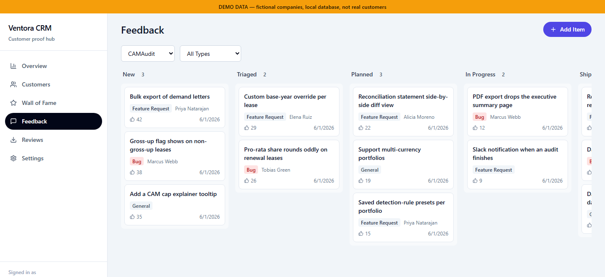
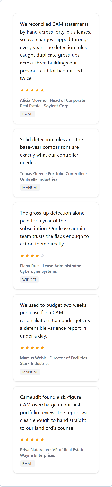
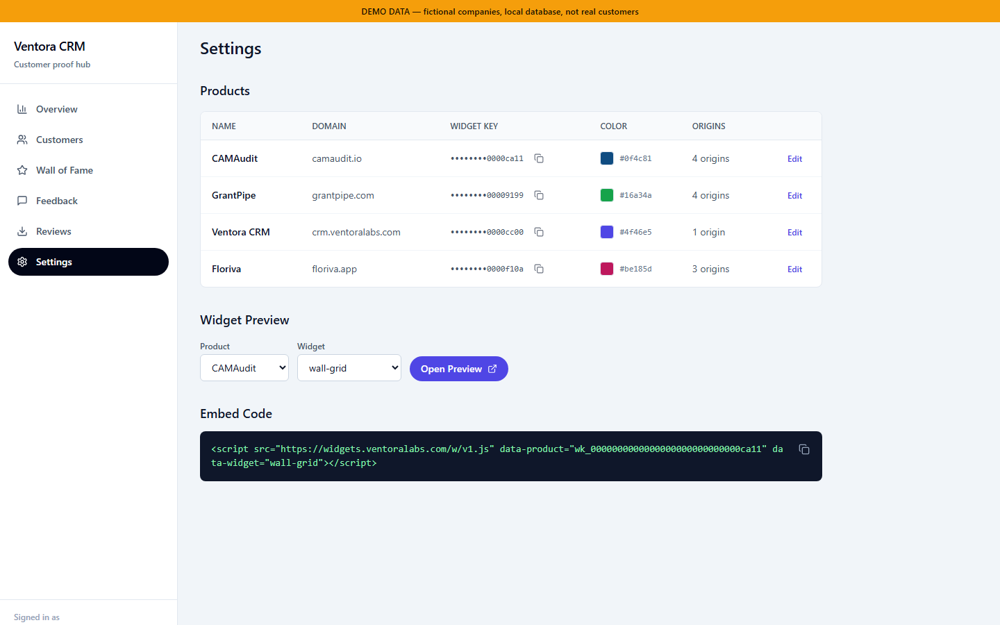
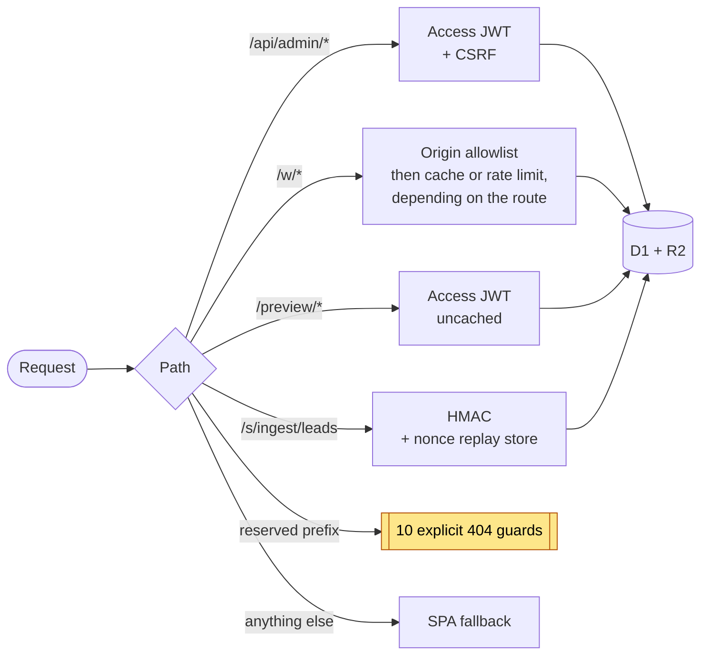
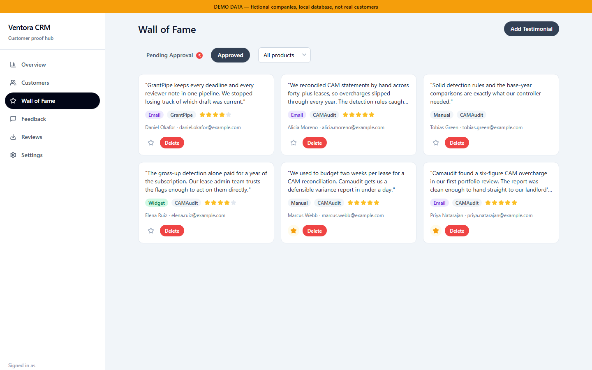
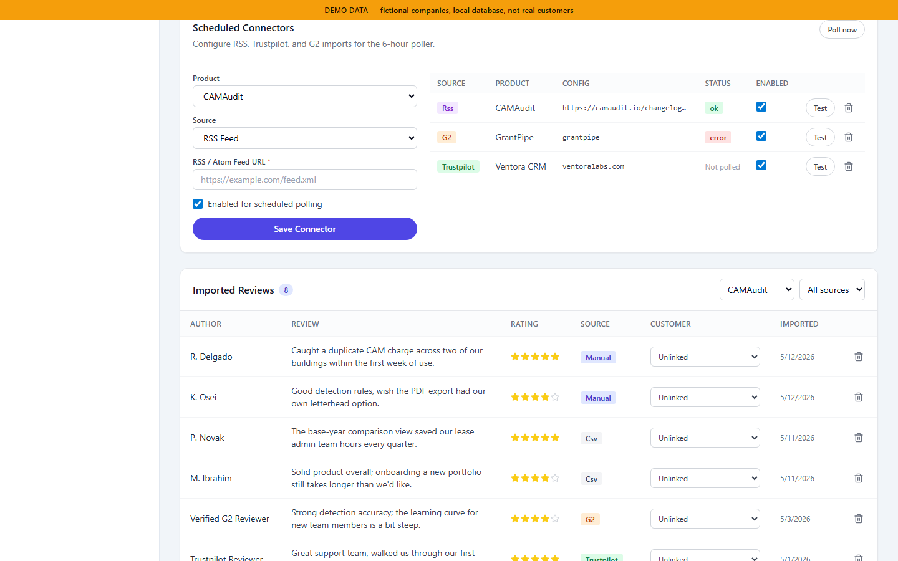
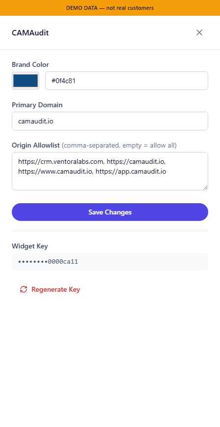
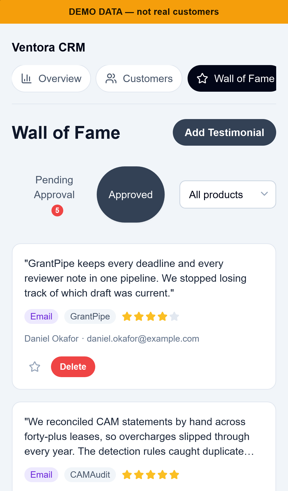

# Ventora CRM

An internal CRM and embeddable-testimonial system on Cloudflare Workers, built to serve every
product in one small studio's portfolio at once. Its hardest business rule, that two products may
never share a customer, is enforced twice: once in TypeScript, and once in SQLite triggers, so
the database rejects a violation even when the application is bypassed.

> [!IMPORTANT]
> **Status: retired.** Ventora CRM ran in production on Cloudflare Workers, serving a multi-product
> portfolio's own customer records. The studio behind it has been wound down, so read everything here
> in the past tense. This is a published snapshot of a tool developed over 179 commits across roughly
> two months, presented here as a single commit, with the internal operational history left behind.

> [!NOTE]
> Built solo by Angel Campa, with AI agents doing most of the typing under direct, reviewed
> supervision: see [Built with AI agents](#built-with-ai-agents). No license is granted; all
> rights reserved. Full terms in [LICENSE](./LICENSE).


*The admin overview, captured from the local stack against seeded demo data: every company and
testimonial visible anywhere in this repository is fictional. The orange banner is not decoration;
the capture harness stamps it onto every screenshot itself.*

→ [portfolio/](./portfolio/) holds six write-ups: architecture, security, testing, the full
screenshot gallery, the engineering log, and every number in this README with the rule used to
count it, plus the index at [portfolio/README.md](./portfolio/README.md).

---

## Contents

- [If you read one thing](#if-you-read-one-thing)
- [What it did](#what-it-did)
- [Architecture](#architecture)
- [The hard part](#the-hard-part)
- [Engineering decisions worth defending](#engineering-decisions-worth-defending)
- [By the numbers](#by-the-numbers)
- [Testing](#testing)
- [Screenshots](#screenshots)
- [Repository map](#repository-map)
- [Documentation](#documentation)
- [Built with AI agents](#built-with-ai-agents)
- [Running it locally](#running-it-locally)
- [Who built this](#who-built-this)
- [License](#license)

---

## If you read one thing

The conflict-of-interest firewall, in [The hard part](#the-hard-part) below: a business rule
enforced twice, once in TypeScript and once in thirteen SQL triggers, because a customer can become
associated with a product through four different tables, and a single service-layer check is one
forgotten write path away from being quietly wrong forever.
[SECURITY.md §5](./portfolio/SECURITY.md#5-the-conflict-of-interest-firewall) has the full account,
including the one gap the design still leaves open.

That is the one thing worth reading to understand what this system was built to guarantee.
[portfolio/README.md](./portfolio/README.md#if-you-are-only-going-to-read-one) points elsewhere, to
[ENGINEERING-LOG.md §2](./portfolio/ENGINEERING-LOG.md#2-qualification-scores-were-wired-to-the-wrong-place-and-would-have-landed-as-null),
for a different reason: the best single story of a defect found and fixed. Both pointers stand:
they are answering different questions.

---

## What it did

- **Customers** was the record of everyone who touched a product, with a merged activity timeline.
- **Wall of Fame** held testimonials behind an approval workflow, feeding the embeddable widgets.
- **Feedback** tracked feature requests and bugs on a drag-and-drop board.
- **Reviews** imported review data through connectors for manual paste, CSV, RSS, and public-page
  scrapers.
- **Settings** held per-product widget keys, origin allowlists, and copy-paste embed snippets.


One row per person, with a `PRODUCTS` column listing every product they touched. Those tags are
exactly what the firewall constrained, and a customer could acquire one through four different
tables: an explicit link, a testimonial, a review, or a feedback item.



Feature requests and bugs moved across a six-column drag-and-drop board, filtered per product. Each
card carried the customer who asked, which fed the merged timeline on their record.

Five widgets (`wall-grid`, `wall-carousel`, `single-quote`, `rating-badge`, `feedback-button`) were
server-rendered to HTML and CSS strings inside the Worker, then injected into a **Shadow DOM** by a
small, directly authored loader. No framework shipped to the customer's page, and host-page CSS could
not reach inside the widget.


That is the widget with no sandbox around it: a plain host page, the real `<script>` loader tag, and
a Shadow DOM the host page's CSS could not see into. Nothing in the frame is admin chrome. The same
embed at a 390px viewport, where the grid collapses to one column:





Everything a product needed to embed a widget lived on one row: the public widget key, the origin
allowlist, and the generated `<script>` tag. The rest of the set (the other four widgets, the
import pipeline, the confirm dialogs, mobile) is in
[SCREENSHOTS.md](./portfolio/SCREENSHOTS.md).

---

## Architecture

One Worker, four route buckets across three auth mechanisms, and a routing order that was
load-bearing.



The guards existed because Static Assets was configured with SPA fallback: without them,
`/api/does-not-exist` would have returned the admin app's HTML with a 200.

→ [ARCHITECTURE.md §1](./portfolio/ARCHITECTURE.md#1-request-lifecycle) walks a request through
the route buckets in order ·
[SECURITY.md §6](./portfolio/SECURITY.md#6-deny-by-default-routing) covers why the guards were
explicit rather than a catch-all

---

## The hard part

The transaction is a commercial lease. A landlord bills a building's operating costs, the tenants
reimburse their share, and once a year the two sides argue about the arithmetic. One product in this
portfolio worked that argument from the tenant's side: it audited the landlord's reconciliation
statement for overcharges and drafted the dispute letter. A second product in the same portfolio
worked the landlord's side of the same reconciliation.

Running both out of one customer database is a conflict of interest. A person who appears as a
customer of one must never be reachable as a customer of the other.

**Only one side of that pair is in this snapshot.** `scripts/seed-products.ts:52` puts exactly one
product into a firewall group (`camaudit-v2`, group `cre`), and `tests/fixtures/products/` ships
two product files in total; the rest of the catalog lived behind `VENTORA_PRODUCTS_DIR`
(`scripts/seed-products.ts:14-23`). So the invariant below is enforced in full, and exercised here
by a group with one member. That order was the point. A rule you add after the second product
ships is a rule you add to a database that may already violate it.

The obvious implementation is a check in the service layer. The problem is that a customer becomes
associated with a product through **four** different tables: an explicit link, a testimonial, a
review, or a feedback submission. So a single service-layer check is one forgotten write path away
from being quietly wrong forever.

So the invariant lives in the database. Each of those four tables carries `BEFORE INSERT` and
`BEFORE UPDATE` triggers. Here is one of the thirteen, from
`migrations/0006_product_scoped_reviews_and_customer_product_update_guards.sql`, reproduced verbatim
apart from some added whitespace to line the `UNION` up:

```sql
CREATE TRIGGER IF NOT EXISTS trg_customer_products_firewall_insert
BEFORE INSERT ON customer_products
FOR EACH ROW
WHEN EXISTS (
  SELECT 1
    FROM products candidate
    JOIN (
      SELECT product_id FROM customer_products WHERE customer_id = NEW.customer_id
      UNION
      SELECT product_id FROM testimonials      WHERE customer_id = NEW.customer_id
      UNION
      SELECT product_id FROM reviews           WHERE customer_id = NEW.customer_id
      UNION
      SELECT product_id FROM feedback_items    WHERE customer_id = NEW.customer_id
    ) associated ON 1 = 1
    JOIN products existing ON existing.id = associated.product_id
   WHERE candidate.id = NEW.product_id
     AND candidate.firewall_group IS NOT NULL
     AND existing.firewall_group = candidate.firewall_group
     AND existing.id != candidate.id
)
BEGIN
  SELECT RAISE(ABORT, 'FIREWALL_VIOLATION');
END;
```

Four tables can form the association, but a **fifth** table carries a trigger too, and it closes
the hole the other four leave open. `trg_products_firewall_group_update`
(`migrations/0005_complete_firewall_product_update_guards.sql:81-111`, re-created in `0006`) fires
on `UPDATE OF firewall_group ON products` and raises the same `FIREWALL_VIOLATION`. Without it
nobody has to touch an association at all: moving an existing product into an already-occupied
group by editing one column would create exactly the conflict the other twelve triggers exist to
prevent. Thirteen triggers, five tables.

The TypeScript layer still exists, because a trigger cannot produce an error message a non-engineer
can act on. But the division of labour is deliberate:

> **The trigger is the invariant. The TypeScript is the user experience.**

Nothing that writes to those five tables can violate the rule: not a migration, not a repair
script, not a stray `wrangler d1 execute`, and not a route added later by someone who never read
this file. And it was verified rather than asserted: `npm run verify:firewall` writes real SQL to a real database,
attempts an actual violation, and asserts the abort.

→ [SECURITY.md §5](./portfolio/SECURITY.md#5-the-conflict-of-interest-firewall) accounts for all
thirteen triggers across five tables, the four ways an association can form, and the one gap this
design still leaves open

---

## Engineering decisions worth defending

**Coverage thresholds are scoped, not global.** 95% on seven security-critical modules, and no
enforced floor elsewhere. A global 95% across ~14,000 lines of application code is a number you
hit by writing shallow tests for view code; it says nothing about whether the parts that can hurt
you are correct. The selection rule is explicit: a module is in scope if a bug in it causes an
auth bypass, a data-isolation violation, or silent data loss. *Tradeoff: everything outside those
modules has tests but no gate.*

**HMAC is verified before the database is touched.** Unauthenticated probes never reached D1. A
valid signature already proved the caller knew the shared secret, so returning 404 afterwards for
an unknown product leaked nothing. *Tradeoff: none. This one is strictly better, which is why the
ordering is documented in the route header.*

**The nonce is burned after body validation, not before.** A signed request with a malformed body
must not permanently consume its own nonce, or a legitimate retry becomes impossible.

**Rate limiting is one SQL statement.** A conditional `ON CONFLICT DO UPDATE ... WHERE ...
RETURNING` returned no row when over the limit, so the limit decision *was* the write and there
was no read-modify-write window. *Tradeoff: keyed on IP and origin, so a distributed source routes
around it.*

**Schema changes were staged around the Worker deploy.** D1 migrations and Worker code deploy
independently, so a migration that isn't backward-compatible with the currently-live Worker breaks
production during the gap. Phase 1 applied only old-Worker-safe changes, the Worker deployed, then
phase 2 applied the rest. *Tradeoff: a duplicated migration subset and a more complex deploy.*

**Tests ran against real SQL.** `tests/helpers/real-d1.ts` built an in-memory database with
`node:sqlite` and applied every real migration, so tests asserted that firewall violations genuinely
aborted, something a mocked D1 can never do, because a mock agrees with whatever you tell it.

→ [TESTING.md §3](./portfolio/TESTING.md#3-the-coverage-philosophy) names the seven gated modules
and the selection rule ·
[TESTING.md §8](./portfolio/TESTING.md#8-what-isnt-tested) is the list of what had no coverage at
all

---

## By the numbers

<!-- METRICS:START (generated by scripts/repo-metrics.mjs --write) -->
| | |
|---|---|
| Lines of code | **35,813** across 192 files |
| Application vs test code | 13,971 / 13,844 lines (**1.01:1**) |
| Tests | 573 cases declared across 60 files, plus 29 screenshot specs |
| API surface | 53 endpoints, plus 10 explicit 404 guards |
| Database | 14 tables, 17 triggers, 20 indexes |
| Coverage gate | 95% on 7 security-critical modules |
| Deploy gate | 14 automated checks in one command |
| Runtime | Cloudflare Workers · D1 · R2 · Hono 4 · React 19 |
<!-- METRICS:END -->

Regenerated by `node scripts/repo-metrics.mjs`; `npm run metrics:check` fails if these drift from
the code. Counting rules and the full breakdown are in
[portfolio/METRICS.md](./portfolio/METRICS.md), including the regexes, so you can re-derive every
figure rather than take my word for it.

---

## Testing

573 test cases declared across 60 files, in three suites that gate the build: unit (450, Vitest in
`node`), admin component (83, Vitest in `jsdom`), and end-to-end (40, Playwright against a real
`wrangler dev` and a real D1). A fourth suite, 29 screenshot specs across 2 files, drives
`npm run shots` and is not part of the gate.

Coverage is enforced at 95% (lines, functions, branches, statements) on seven modules, selected by
one rule: a module is in scope if a bug in it causes an auth bypass, a data-isolation violation, or
silent data loss. `src/lib/firewall.ts` and `src/lib/sdr-hmac.ts` are two of the seven; nothing
outside that list has an enforced floor. See
[TESTING.md §3](./portfolio/TESTING.md#3-the-coverage-philosophy) for the full list and the
reasoning behind the scoping.

Tests ran against a real database, not a mock: `tests/helpers/real-d1.ts` builds an in-memory
SQLite database with `node:sqlite` and applies every migration in `migrations/`, so a firewall
violation can be asserted to genuinely abort.

`npm run verify:rollout` is fourteen steps: lint, typecheck, coverage, a full local
migrate/seed/retire/origins cycle, the seven verifier scripts, e2e, a dry-run deploy, and
`npm audit`, run manually before every deploy. **There is no CI.** The gate is thorough, but it
protected the codebase only as long as someone remembered to run it.

→ [TESTING.md](./portfolio/TESTING.md)

---

## Screenshots

Twenty-five of the thirty-three captures `npm run shots` produces are embedded across this README
and [SCREENSHOTS.md](./portfolio/SCREENSHOTS.md); those live in
[`portfolio/screenshots/`](./portfolio/screenshots/). The other eight sit in
[`docs/screenshots/`](./docs/screenshots/) as the working archive: captured, but never chosen
for a write-up.

Every one comes from the same local database, seeded by `scripts/seed-demo.ts` with fictional
companies (Acme, Globex, Umbrella, Wayne Enterprises, and friends) and `@example.com` addresses. No
real customer data or real testimonial appears anywhere in this repository.

<table>
<tr>
<td>



Wall of Fame, approved: the testimonials `single-quote` and `wall-grid` could serve

</td>
<td>



Review connectors: manual paste, CSV, and RSS, each polled independently

</td>
</tr>
<tr>
<td>



Settings: editing one product's origin allowlist and widget key

</td>
<td>



The same Wall of Fame at a 390px mobile viewport

</td>
</tr>
</table>

The full set, all six categories, is in [SCREENSHOTS.md](./portfolio/SCREENSHOTS.md).

---

## Repository map

```text
src/               Cloudflare Worker
  worker.ts        entry point; route buckets, 404 guards, SPA fallback
  lib/             auth (Access JWT), sdr-hmac, firewall, cache
  routes/          admin/, widget/, preview/, ingest/, sdr-ingest/
  widgets/         the five server-rendered widget renderers
  connectors/      review import sources
  db/              query layer
admin/             React 19 + Vite admin SPA (own tsconfig and Tailwind config)
migrations/        D1 schema; the firewall triggers live here
migrations_phase1/ the old-Worker-safe subset, for the staged rollout
scripts/           ops tooling and the verifiers that assert against a real DB
tests/             unit (node), component (jsdom), e2e (real Worker + real D1),
                   screenshots (the capture harness behind npm run shots)
portfolio/         the write-ups, their index, and the 25 referenced screenshots
docs/              the other 8 captures and this repository's own cleanup ledger
```

---

## Documentation

`portfolio/` is retrospective, written for a reader: six write-ups plus an index, every claim
traceable to a file or a command. `docs/` is prospective, written for the author: the raw screenshot
archive and this repository's own cleanup ledger.

→ [portfolio/README.md](./portfolio/README.md) is the index, and links every write-up including
[ENGINEERING-LOG.md](./portfolio/ENGINEERING-LOG.md) · [docs/](./docs/) holds the working residue

---

## Built with AI agents

The 179 commits over roughly two months cited in the status note above were produced with AI coding
agents working under direct, one-change-at-a-time supervision. This snapshot squashes that history
into a single commit, so that count survives only here: there is no commit log left to audit it
against.

`CLAUDE.md`, `AGENTS.md`, and `.claude/` are committed on purpose and reviewed like source, not
scrubbed before publishing. They carry the actual operating rules: the coverage-scoping reasoning in
[Engineering decisions worth defending](#engineering-decisions-worth-defending) and the
no-fabricated-testimonials rule that kept `scripts/seed-demo.ts` fictional (see
[Screenshots](#screenshots)) both come from those files, not from memory.

One concrete thing the process enforced rather than suggested: `test:coverage` fails the build below
95% on the seven security-critical modules named in
[TESTING.md §3](./portfolio/TESTING.md#3-the-coverage-philosophy), and `verify:rollout` will not
reach a dry-run deploy if it does.

---

## Running it locally

```bash
npm install
cp .dev.vars.example .dev.vars   # usable as-is; no real credentials needed locally
npm run db:migrate               # local D1
npm run db:seed                  # products from tests/fixtures/products/*.md
npm run db:origins
npm run build:admin              # the ASSETS binding serves admin/dist
npm run dev                      # http://localhost:8787
```

`DEV_AUTH_BYPASS` short-circuits Cloudflare Access locally. It **fails closed**: the bypass is
refused on any request carrying a `CF-Ray` header, so shipping the flag to production breaks admin
access loudly rather than opening it silently.

To regenerate the screenshots against a throwaway demo database:

```bash
npm run shots
```

The `database_id` in `wrangler.jsonc` is a placeholder. Create your own with
`wrangler d1 create ventora-crm` if you intend to deploy.

---

## Who built this

Angel Campa, solo, with AI agents doing most of the typing under direct supervision: see
[Built with AI agents](#built-with-ai-agents). Questions about anything here:
[github.com/AngelCampa1](https://github.com/AngelCampa1).

---

## License

No license granted; all rights reserved. Published for review as a portfolio piece. Full text in
[LICENSE](./LICENSE).
