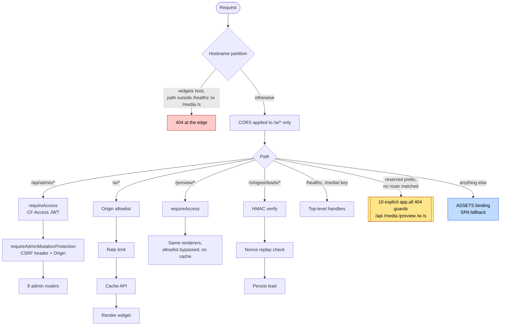
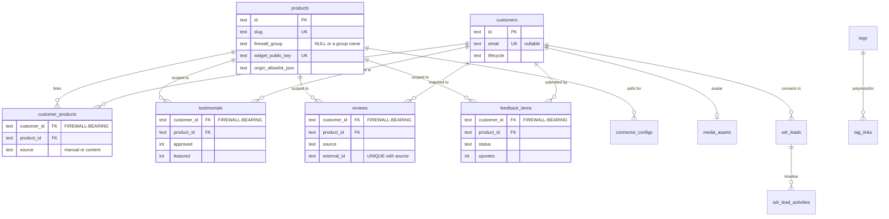
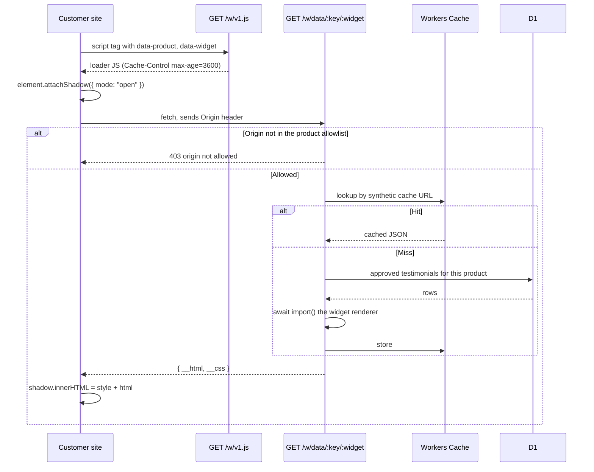
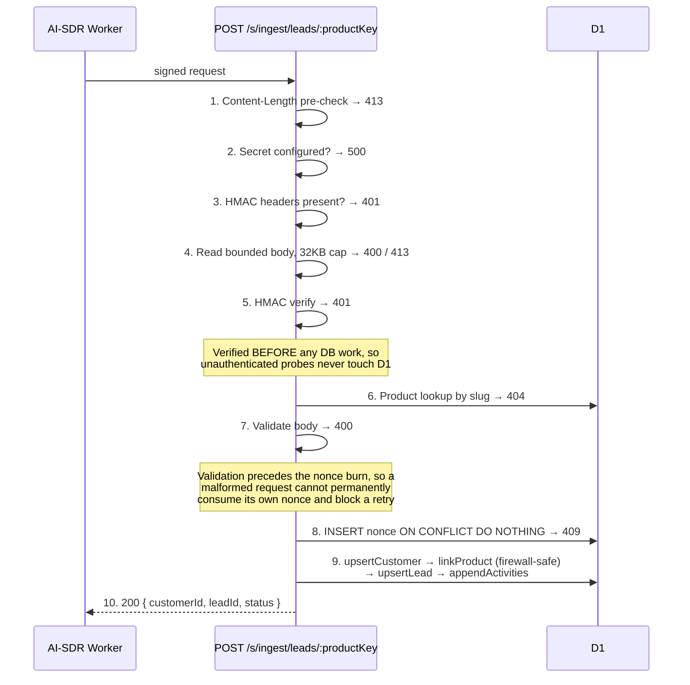

# Architecture

One Cloudflare Worker serves three surfaces with three different auth postures, backed by D1 and R2.
There is no server, no container, and no VPC. The whole backend is `src/worker.ts` and what it
mounts.

- **Runtime**: Cloudflare Workers, Hono 4, `nodejs_compat`
- **Data**: D1 (SQLite) for relational state, R2 for media, the Workers Cache API for edge caching
- **Frontend**: React 19 + Vite, served from the Static Assets binding
- **Scheduled**: one cron trigger, every six hours, polling review connectors

---

## 1. Request lifecycle

Route order is load-bearing. The real routers mount first, then a block of explicit 404 guards, and
only then the SPA fallback. Get that order wrong and the admin SPA's `index.html` starts answering
`/api/does-not-exist` with a 200.



### Route inventory

| Bucket | Count | Auth posture |
|---|---:|---|
| `/api/admin/*` | 44 | Cloudflare Access JWT, plus a CSRF header and Origin check on every mutation |
| `/w/*` | 3 | Public, and not uniform. See the note below the table |
| `/preview/*` | 3 | Cloudflare Access. Same renderers as `/w/*`, allowlist bypassed, never cached |
| `/s/ingest/leads/:productKey` | 1 | HMAC-SHA256 over a canonical payload, with a nonce replay store |
| Top level | 2 | `/healthz` public; `/media/:key` gated by the media registry |
| **404 guards** | **10** | `app.all` on `/api`, `/media`, `/preview`, `/w`, `/s` (bare and wildcard) |
| SPA fallback | 1 | Everything else falls through to the built React app |

The three public `/w/*` routes do not share one posture, and it would be convenient but wrong to
summarise them as though they did:

| Route | Origin allowlist | Rate limit | Edge cache |
|---|:--:|:--:|:--:|
| `GET /w/v1.js` (`widget/index.ts:198`) | no | no | no |
| `GET /w/data/:key/:widget` (`widget/index.ts:207`) | yes | no | yes |
| `POST /w/ingest/:key` (`ingest/index.ts:186`) | yes | yes | no |

The loader is a static asset with no per-product data in it, so it needs neither. Reads are cached
and not rate limited; the write path is rate limited and never cached. The one gap worth naming is
that
`/w/data/*` has no rate limit of its own, and leans on the edge cache to absorb repeat traffic.

`run_worker_first: ["/*"]` in `wrangler.jsonc` is what makes the guards reachable at all: the Worker
has to run before Static Assets, or the SPA fallback would claim reserved prefixes first.

---

## 2. Data model

Fourteen tables. The four highlighted below are the ones that matter most, because **any** of them
can create an association between a customer and a product, which is the entire problem the
conflict-of-interest firewall exists to solve. A check that only looked at `customer_products` would
miss three quarters of the ways the association actually forms.



Operational tables sit outside that graph: `ingest_rate_limit` (one row per product+identity
window),
`sdr_ingest_nonce` (replay protection), and `media_assets` (the R2 key registry).

`review_import_backlog` is worth a note precisely because it is *not* here. It is created and
dropped inside the same migration (`migrations/0006`), so it exists only midway through a
migration run and
never in the live schema. `scripts/verify-migration-state.ts` fails the build if it is still present
afterwards.

Seventeen triggers guard these relationships in SQL. See
[SECURITY.md](SECURITY.md#5-the-conflict-of-interest-firewall).

---

## 3. Widget embedding

Widgets are server-rendered to HTML and CSS strings in the Worker, then injected into a Shadow DOM
by a small, directly authored loader. There is no framework on the customer's page, and host-page
CSS cannot reach inside the widget.



`feedback-button` deliberately bypasses the cache (`widget/index.ts:237`, `:341`). It is a write
surface, not a display surface.

**Tradeoffs, stated honestly.** There is no client-side interactivity beyond the feedback modal and
no hydration. The loader is a template literal inside a `.ts` file, which means it is not
lint-checked as JavaScript, a real cost accepted to keep the payload tiny and dependency-free.

The five renderers are reached through `await import()`, but all five are awaited unconditionally
before the dispatch that picks one (`widget/index.ts:312-316`). So the code is written in the shape
that would let a cache miss load only the renderer it needs, and does not currently get that
benefit.
Moving the imports inside the branches is a real, small, unclaimed win, left here as-is rather than
described as an optimisation it is not.

---

## 4. Server-to-server lead ingest

The most carefully ordered code path in the repository. Each numbered step is a gate, and the
ordering is deliberate rather than incidental.



Verifying the signature before the product lookup does not leak anything: a valid signature already
proves the caller knows the shared secret, so a subsequent 404 for an unknown product tells them
nothing they could not already determine.

---

## 5. Caching

Workers Cache API only. No KV, deliberately: KV carries ongoing cost for a workload that is
overwhelmingly read-light, and the Cache API is free at the edge.

Synthetic cache URLs are built per product and widget by `buildCacheUrl(productSlug, widget)`, and
busted precisely by `bustProductWidgets(slug)` when a testimonial is approved, unapproved,
featured, or unfeatured.

**Limitation worth knowing:** the Cache API is per-colocation. Invalidation is therefore
best-effort: a colo that never saw the bust can serve a slightly stale wall until its entry
expires. For approved testimonials on a marketing page, that is an acceptable trade. For anything
transactional it would not be.

---

## 6. The admin SPA

Six pages, all `React.lazy` behind a single `<Suspense>` in `Layout`. TanStack Query owns server
state; there is no Redux and no global store, because every piece of state in this app belongs to
a server resource. `dnd-kit` drives the feedback Kanban.

Served by the Static Assets binding with `not_found_handling: "single-page-application"`, which is
why the 404 guards in §1 exist.

`npm run dev` runs `vite build --watch` rather than the Vite dev server, because the Worker's ASSETS
binding reads from `admin/dist`. The dev server would leave that directory stale.

---

## 7. Deployment and the staged rollout

D1 migrations and Worker code deploy independently. That gap is the whole problem: between
applying a migration and deploying the Worker that understands it, production is running old code
against a new schema. A migration that is not backward-compatible with the currently-live Worker
breaks the site during that window.

So schema changes are staged around the deploy:

```text
deploy:phase1:schema   →   deploy:worker   →   deploy:phase2:schema
```

- **Phase 1** applies only migrations that are safe for the *old* Worker: additive columns, new
  tables, new indexes. It runs from `wrangler.phase1.jsonc`, pointed at `migrations_phase1/`.
- **The Worker deploys** and now understands both shapes.
- **Phase 2** applies the rest: constraints, table rebuilds, and anything the old code would have
  choked on.

`scripts/verify-deployed-worker.ts` runs between the stages and asserts the live Worker is
actually on the expected schema version before phase 2 lands. `migrations_phase1/` intentionally
re-states a subset of `migrations/`. That duplication is the mechanism, not an accident.

---

## 8. Screenshots

Split into its own document, since a full gallery pushes this file past the length this corpus
holds architecture write-ups to. [SCREENSHOTS.md](./SCREENSHOTS.md): 25 captures across six
categories (admin, Wall of Fame, feedback and reviews, widgets, settings, and responsive), each
with the file and line of the route or component it shows.
