# Screenshots

The screenshots below show this system running against a local database seeded with **fictional**
companies and quotes (`npm run shots`). Acme, Globex, Initech, Umbrella, Wayne Enterprises,
Northwind, Stark, Hooli, Cyberdyne, Soylent, and Vandelay are placeholders; every address is
`@example.com`. No real customer data and no real testimonial appears anywhere in this repository.

Each image is captured by `tests/screenshots/`, not taken by hand: the orange banner is injected
by the harness, and every wait is a concrete locator rather than a sleep, so the set regenerates
identically. These 25 captures are the ones referenced from [`README.md`](../README.md) and this
file, so they live in [`screenshots/`](./screenshots/) alongside it; the remaining 8 that
`npm run shots` produces but nothing links to stay in
[`../docs/screenshots/`](../docs/screenshots/) as the raw archive.

---

### Admin

<table>
<tr>
<td>

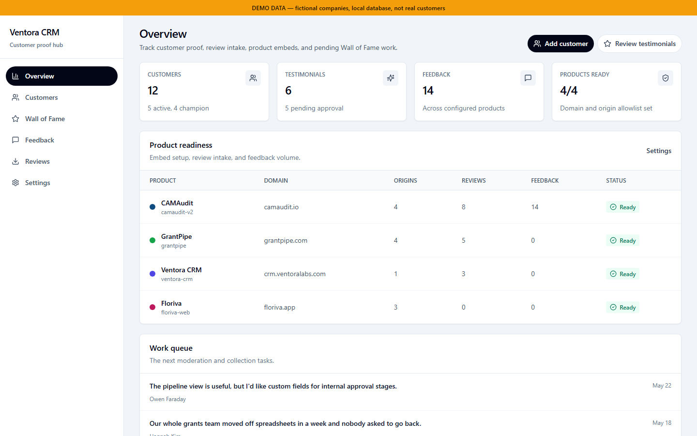

Overview: per-product readiness and the moderation queue

</td>
<td>

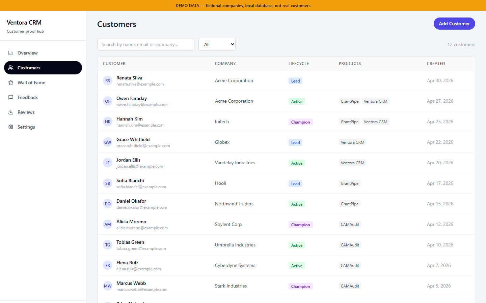

Customers: lifecycle, linked products, merged from every source

</td>
</tr>
<tr>
<td>

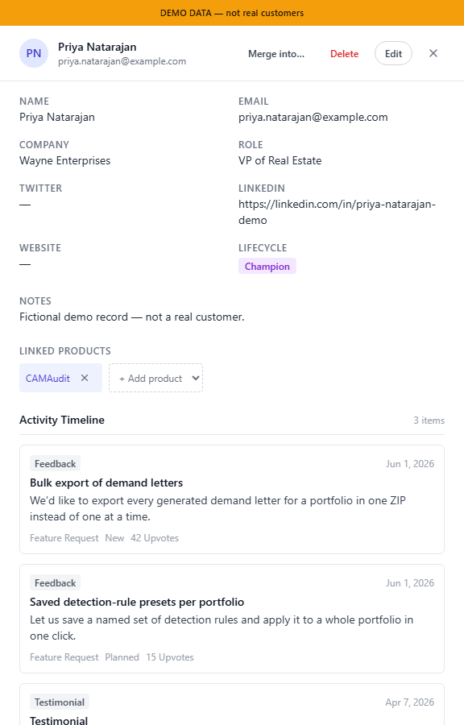

Detail drawer: the activity timeline merges feedback, testimonials, and reviews

</td>
<td>

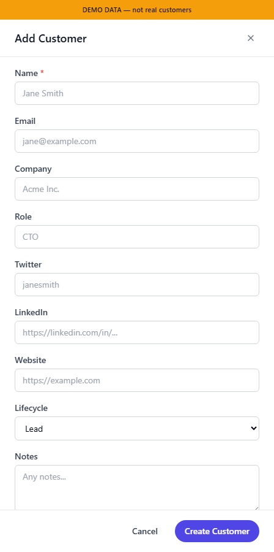

Create sheet: product links go through the firewall check

</td>
</tr>
</table>

### Wall of Fame

<table>
<tr>
<td>

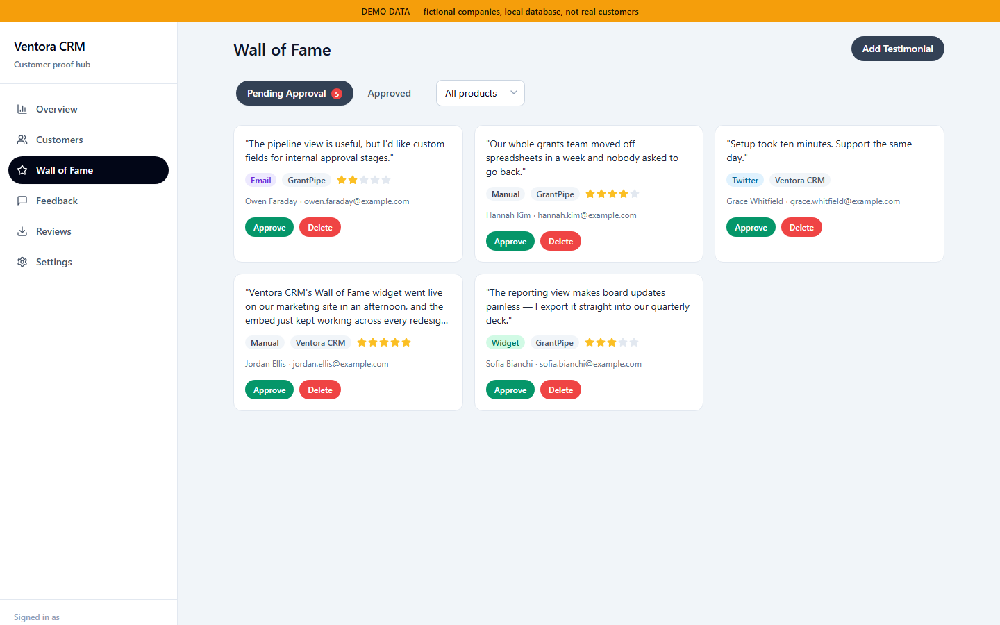

Pending queue: nothing reaches a widget before approval

</td>
<td>

Approved: starred entries are the ones `single-quote` will serve

</td>
</tr>
<tr valign="top">
<td>

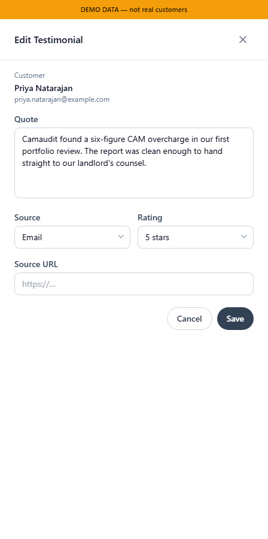

Edit drawer

</td>
<td>

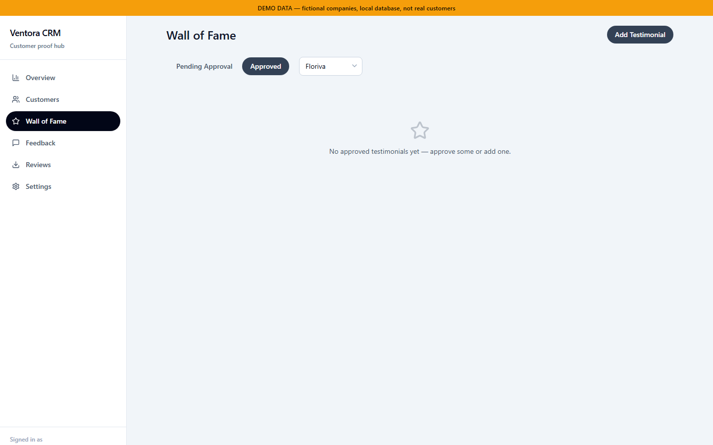

Empty state: a product with no approved content yet

</td>
</tr>
</table>

### Feedback and reviews

<table>
<tr>
<td>

Six-column board (it scrolls horizontally)

</td>
<td>

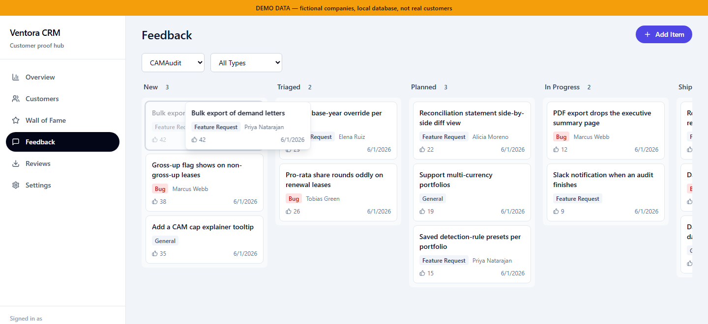

Mid-drag, driven by the keyboard sensor so the capture is deterministic

</td>
</tr>
<tr>
<td>

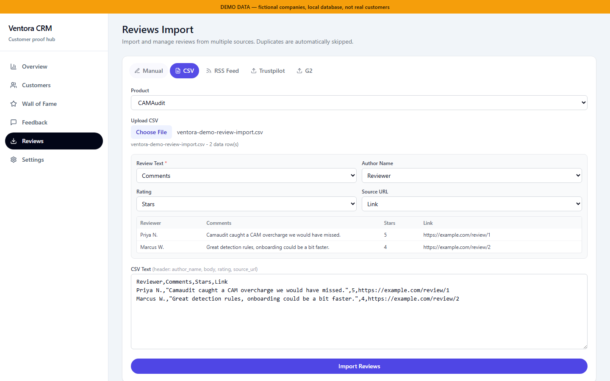

CSV import: headers inferred from a non-canonical file

</td>
<td>

Scheduled connectors, showing all three poll states

</td>
</tr>
</table>

### Widgets

Rendered inside a Shadow DOM from the Worker's own HTML/CSS strings, shown here through
`/preview/*`.

<table>
<tr>
<td>

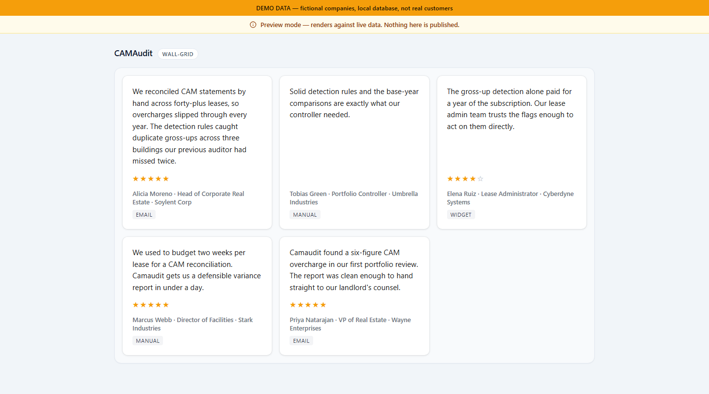

`wall-grid`

</td>
<td>

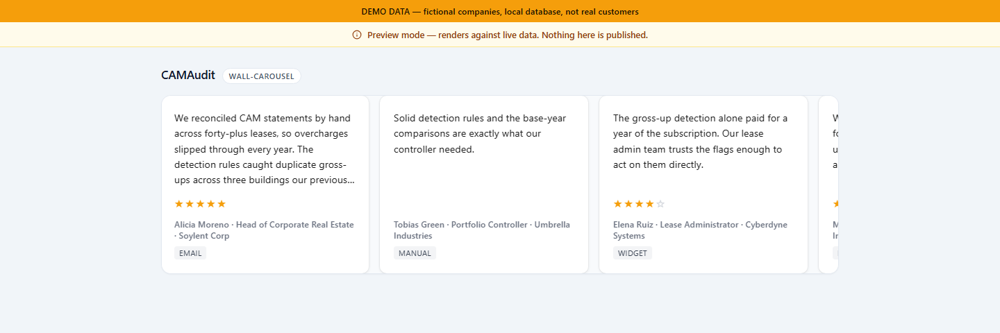

`wall-carousel`: the same quotes, clamped

</td>
</tr>
<tr>
<td>

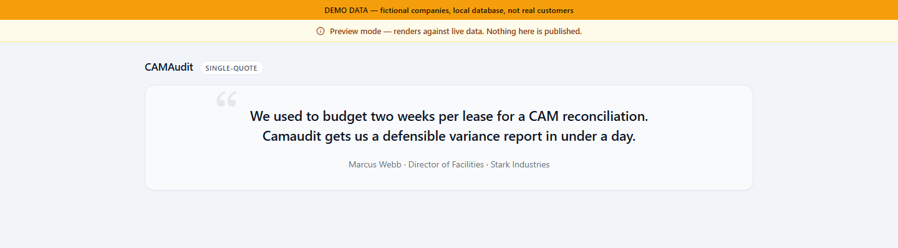

`single-quote`: featured only

</td>
<td>

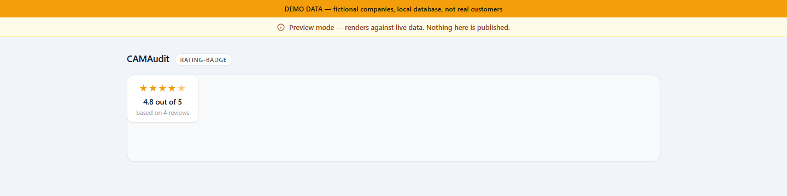

`rating-badge`: aggregate over approved entries

</td>
</tr>
<tr>
<td>

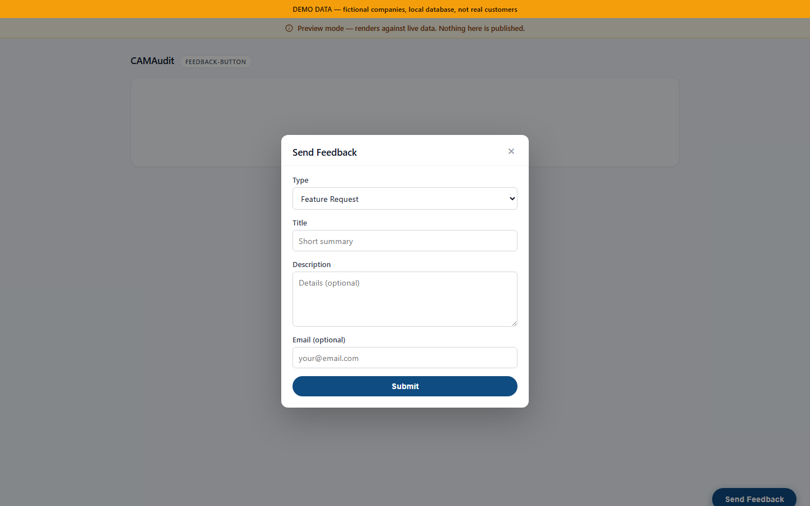

`feedback-button`, modal open

</td>
<td>

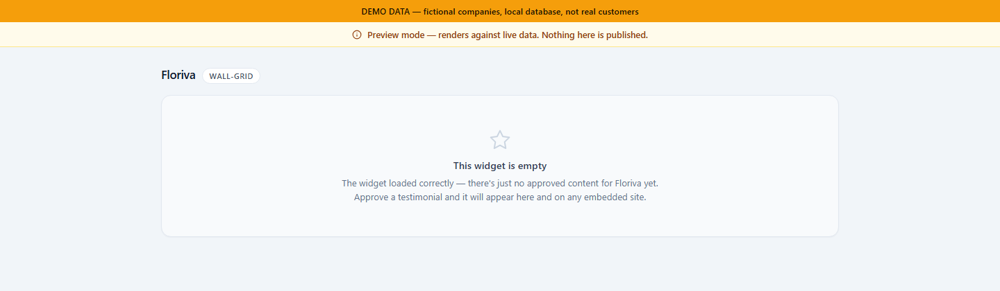

`wall-grid`, the deliberate empty state

</td>
</tr>
</table>

The five shots above go through `/preview/*`, an admin-only sandbox, so every one of them carries
the admin harness's banner. That is correct for a preview, but it understates what actually
ships: on a real customer page there is no banner, no admin chrome, nothing but the widget.

The two shots below are captured a different way, against
[`tests/fixtures/embed-sandbox.html`](../tests/fixtures/embed-sandbox.html), a plain static host
page with the production `<script data-product data-widget>` loader tag and nothing else, served
from an ordinary web origin against a local worker seeded with the same fictional dataset. This is
what `wall-grid` looks like dropped onto a third-party site.

<table>
<tr valign="top">
<td>

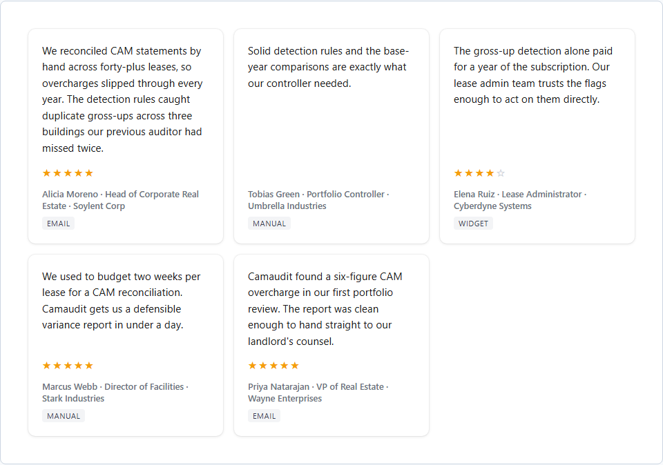

`wall-grid`, embedded on a plain host page, desktop width

</td>
<td>

Same embed at mobile width

</td>
</tr>
</table>

### Settings and embedding

<table>
<tr valign="top">
<td>

Everything a product needs to embed: public widget key, origin allowlist, generated `<script>` tag

</td>
<td>

Editing one product's origin allowlist

</td>
</tr>
</table>

### Responsive

<table>
<tr>
<td>

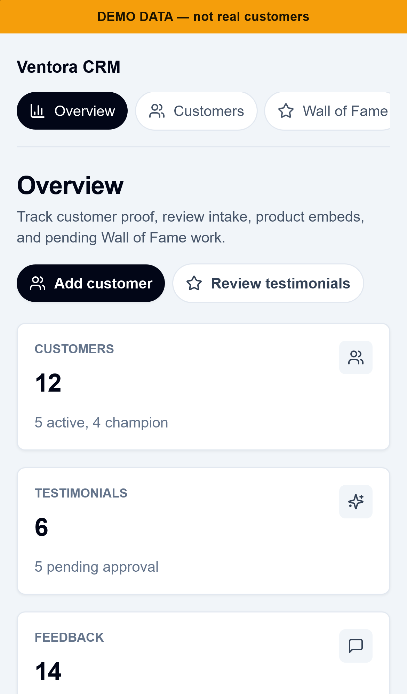

Mobile admin overview

</td>
<td>

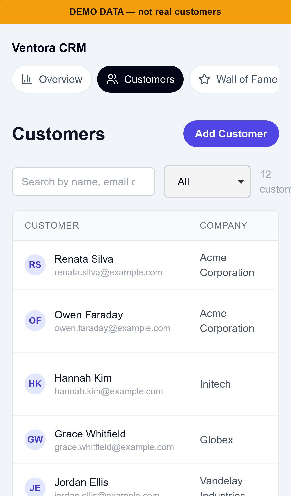

Mobile customers list

</td>
<td>

Mobile Wall of Fame approved view

</td>
</tr>
</table>

The full set (the 25 captures above plus the 8 that never made it into a write-up) is split
between [`screenshots/`](./screenshots/) and [`../docs/screenshots/`](../docs/screenshots/).

> There is no screenshot of a firewall rejection. The demo dataset has exactly one product in a
> firewall group, so no conflicting pair exists to trigger one, and inventing a second product
> purely to stage the error would make the image a prop rather than evidence. The rejection is
> demonstrated instead by `npm run verify:firewall`, which performs a real violating insert
> against a real database and asserts the abort.
