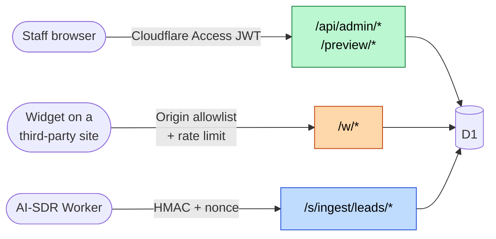

# Security

This is not a compliance document. It is a record of the threats that were considered while building
this system, what was done about each, and (the part that usually gets left out) what each mechanism
does **not** protect against.

Every section names the file so you can check the claim against the code.

---

## 1. Trust boundaries

Three kinds of caller reach this Worker, and they are authenticated three different ways.



| Caller | Boundary | Mechanism | Failure mode |
|---|---|---|---|
| Staff | Cloudflare Access | RS256 JWT, `aud` + `iss` + `exp` verified | 401 |
| Embedded widget | Per-product allowlist | `Origin` match on the data and ingest routes, plus a rate limit on ingest | 403 / 429 |
| AI-SDR Worker | Shared secret | HMAC-SHA256 over a canonical payload, plus a nonce store | 401 / 409 |

---

## 2. Admin authentication

**Threat:** anyone on the internet reaching admin CRUD.

**Mechanism**: `src/lib/auth.ts`. Cloudflare Access terminates SSO and forwards a signed JWT. The
Worker verifies it rather than trusting it:

- **`alg` must be `RS256`.** Anything else throws (`auth.ts:167`). This is the algorithm-confusion
  defence: without it, a token claiming `alg: "none"` or a symmetric algorithm could be forged.
- **JWKS** is fetched from `https://{team}/cdn-cgi/access/certs` and cached in module scope for 10
  minutes. On a `kid` that isn't in the cache, it forces **one** refresh before giving up
  (`auth.ts:206`), so a Cloudflare key rotation causes a single extra fetch rather than an outage.
- **`exp`, `aud`, and `iss` are all checked** (`auth.ts:185-191`). The `iss` check is the one most
  tutorials skip; without it a valid token from a *different* Access team would pass.
- An `email` claim is required, and becomes `c.get("accessEmail")`.

**The dev bypass, and why it fails closed.** `DEV_AUTH_BYPASS=true` short-circuits all of the above,
but only when the request carries no `Cf-Access-Jwt-Assertion` header at all (`auth.ts:44`). If a
token is present it is verified in full, bypass or not. That would still be a catastrophic footgun
if it were shippable. It isn't. `isLocalDevRequest` (`auth.ts:106`) refuses the bypass if the
request carries a `CF-Ray` header, which every request through Cloudflare's edge has. Deploying the
flag to production therefore breaks admin access loudly rather than opening it silently.

**Does not protect against:** a compromised identity provider, or an insider with valid SSO. And
there is **no per-user authorization**: every authenticated staff member is a full admin, with no
roles, no read-only access, and no audit trail of who changed what.

---

## 3. Admin mutation protection

**Threat:** a logged-in staff member visits a hostile page that fires requests at the CRM using
their Cloudflare Access session.

**Mechanism**: `validateAdminMutationRequest`, `src/lib/auth.ts:127`. Every `POST`/`PUT`/`PATCH`/
`DELETE` must carry `X-Ventora-CSRF: 1`. A cross-origin HTML form cannot set a custom header, so
this forces a CORS preflight the attacker's origin will fail. On top of that, `Origin` must match
the request origin when present, with `Referer` as the fallback when it isn't.

This runs *in addition to* Access, not instead of it. Access answers "who are you"; this answers
"did you mean to send this".

**Does not protect against:** an attacker who can execute script on an allowed origin.

---

## 4. Server-to-server ingest

**Threat:** forged or replayed lead submissions from anyone who can reach the public endpoint.

**Mechanism**: `src/lib/sdr-hmac.ts` for signing and verification, `src/routes/sdr-ingest/index.ts`
for the replay store. The canonical signed string is:

```text
${timestamp}.${nonce}.${METHOD}.${path}.${sha256Hex(stableJson(body))}
```

Every component earns its place: the **timestamp** binds freshness, the **nonce** binds uniqueness,
**method and path** prevent a valid signature being replayed against a different endpoint, and the
**body hash** prevents tampering.

- **`stableJson`** sorts object keys recursively, drops `undefined`, and preserves array order. A
  canonical serializer is not optional here: both ends must produce byte-identical input, and JSON
  key order is not guaranteed by anything.
- **`constantTimeEqual`** (`sdr-hmac.ts:122`) folds the length difference *into the same
  accumulator* as the character XORs and iterates to the longer length. The loop never
  short-circuits, so a length mismatch is indistinguishable from a content mismatch by timing.
- **Clock skew** is ±5 minutes, checked **before** the crypto so an expired request is cheap to
  reject.
- **Replay protection** is a single atomic `INSERT ... ON CONFLICT(nonce) DO NOTHING`; if
  `meta.changes === 0` the nonce was already used and the request is a 409. There is no
  read-then-write race because the check *is* the write.
- **Nonce validation ordering.** The body is validated at step 7, the nonce burned at step 8.
  Reversing those would mean a signed request with a malformed body permanently consumes its
  nonce, making a legitimate retry impossible.
- **No error oracle.** `hmacResult.reason` distinguishes `malformed_signature`, `invalid_signature`,
  and `timestamp_skew` internally, but the response is always a bare `invalid signature`. Telling
  the caller *which* check failed would help them iterate toward a forgery.

**Does not protect against:** a leaked `CRM_INGEST_SECRET`. It is a single global secret, shared
across every product, with no per-product scoping and no rotation mechanism.

---

## 5. The conflict-of-interest firewall

The most interesting constraint in the system, and the reason two enforcement layers exist.

**The business rule.** Two products in this portfolio sat on opposite sides of one commercial lease
reconciliation: one audited the landlord's statement on behalf of tenants, the other worked the same
reconciliation for the landlord. Running both out of a single customer database is a conflict of
interest, so a person who is a customer of one must never be reachable as a customer of the other.
Products carry a nullable `firewall_group`; a customer may be linked to at most one product per
group.

Only one of that pair is in this snapshot: `scripts/seed-products.ts:52` places `camaudit-v2` in
group `cre` and nothing else in any group. The constraint is enforced in full and exercised by a
group with a single member.

This is *not* multi-tenant row scoping. It is a Chinese wall, and the user-facing error says so
(`src/lib/firewall.ts:54`):

> "…they sit on opposite sides of the same transaction. Keep this customer with one of them."

**Why four tables.** `assertFirewallSafe` unions `customer_products`, `testimonials`, `reviews`, and
`feedback_items`, because the association can form through **any** of them. A testimonial alone
associates a person with a product. A check that only consulted the explicit link table would be
correct-looking and wrong.

**Layer 1: application.** `assertFirewallSafe(db, customerId, candidateProductId)` runs before every
insert into `customer_products` and throws `FirewallViolation`, which the routes turn into a 422
with a message a non-engineer can act on.

**Layer 2: SQL.** Thirteen triggers across **five** tables, each ending in `RAISE(ABORT,
'FIREWALL_VIOLATION')`. Twelve of them are the `BEFORE INSERT`, `BEFORE UPDATE OF customer_id` and
`BEFORE UPDATE OF product_id` set on the four association tables. The thirteenth is
`trg_products_firewall_group_update` on `products` itself
(`migrations/0005_complete_firewall_product_update_guards.sql:81-111`, re-created in `0006`), which
fires on `BEFORE UPDATE OF firewall_group`. That one matters because it closes a path the other
twelve cannot see: moving an existing product into an already-occupied group is a way to manufacture
a violation without touching a single association row.

(The live schema carries 17 triggers in total. The other four are the unrelated `media_assets`
registry guards from `migrations/0007`.)

The argument for doing it twice is not belt-and-braces enthusiasm. The two layers have genuinely
different jobs:

> **The trigger is the invariant. The TypeScript is the user experience.**

The application layer exists to produce a good error message. The SQL layer exists because the
application can be bypassed: by a migration, a repair script, a `wrangler d1 execute` run by a tired
person at midnight, or a route someone adds next year and forgets to guard. Only one of those layers
still holds when the code is wrong.

**It is verified, not asserted.** `npm run verify:firewall` (`scripts/verify-firewall-triggers.ts`)
writes real SQL to a real D1 (local or `--remote`), attempts an actual violation, and asserts the
error text contains `FIREWALL_VIOLATION`. Trigger syntax and ordering are checked by SQLite itself,
not by a mock that would happily agree with whatever it was told.

**Does not protect against:** a table added later that can associate customers with products but
never gets triggers. Nothing automatically enforces that.

---

## 6. Deny-by-default routing

**Threat:** reserved paths silently answering with the SPA.

Static Assets is configured with `not_found_handling: "single-page-application"`. Without
intervention, `GET /api/does-not-exist` returns the admin `index.html` with a **200**, confusing for
API clients, and a mild information disclosure about what the app is.

So ten explicit `app.all` guards sit on `/api`, `/media`, `/preview`, `/w`, and `/s` (bare and
wildcard for each), returning a JSON 404, mounted after the real routers and before the SPA
fallback. A hostname-partition middleware runs even earlier: on the public widgets host, anything
outside `/healthz`, `/w/*`, `/media/*`, and `/s/ingest/` 404s before it reaches a router at all.

Stated precisely: the default for a genuinely unknown path is still the SPA. What the guards buy is
that **reserved prefixes are explicitly denied so the fallback cannot shadow them.**

---

## 7. Widget origin allowlisting

**Threat:** arbitrary sites embedding a product's widgets, and abuse of the feedback write endpoint.

**Mechanism**: `getOriginPolicy`, `src/routes/widget/index.ts:160`. Each product row carries an
origin allowlist. Matching is strict: `url.origin === value`, so a path, query string, or trailing
slash does not match.

The empty-allowlist behaviour is **deliberately asymmetric**, and the code says why:

- **Display widgets** (`wall-grid`, `wall-carousel`, `single-quote`, `rating-badge`) render only
  *approved* testimonials, public content whose entire purpose is to be embeddable. An unset
  allowlist leaves them public.
- **`feedback-button`** is a write surface. An empty allowlist **disables** it, and even with a
  valid allowlist it must additionally originate from the CRM origin or a registered authenticated
  product surface.

**Does not protect against:** forgery. `Origin` is set by the browser and trivially spoofed by any
non-browser client. Origin checking here is an anti-abuse measure for the public web, not
authentication, and should not be mistaken for one.

---

## 8. Rate limiting

**Mechanism**: `src/routes/ingest/index.ts:211`. Ten requests per minute per (product, `Origin` +
`CF-Connecting-IP`), implemented as a single statement:

```sql
INSERT INTO ingest_rate_limit (product_id, origin, window_start, count)
VALUES (?, ?, ?, 1)
ON CONFLICT(product_id, origin) DO UPDATE SET
  window_start = excluded.window_start,
  count = CASE WHEN ingest_rate_limit.window_start = excluded.window_start
               THEN ingest_rate_limit.count + 1 ELSE 1 END
WHERE ingest_rate_limit.window_start != excluded.window_start
   OR ingest_rate_limit.count < 10
RETURNING count
```

The conditional `WHERE` on the `DO UPDATE` is the whole trick: over the limit, the update matches
nothing, so the statement returns **no row** and the handler answers 429. The limit decision *is*
the write: there is no read-modify-write window for a concurrent request to slip through.

**Does not protect against:** distributed sources. It is keyed on IP and origin, so a botnet routes
around it. It also still costs D1 writes under attack. Cloudflare's own rate limiting sits in front
in production; this is the application-level backstop.

---

## 9. Media access

R2 objects are addressed by opaque UUID keys, and `..` is rejected. The useful part is that the
`media_assets` registry is consulted **first**: a soft-deleted asset 404s even if the underlying R2
object still exists. Four triggers back the registry at the SQL layer (`migrations/0009`), of which
two guard removal: one on `BEFORE UPDATE OF deleted_at` and one on `BEFORE DELETE`, so an asset that
is still referenced by a customer cannot be soft-deleted or hard-deleted out from under that
reference. The other two enforce the reference itself on `customers` insert and update. Responses
carry `X-Content-Type-Options: nosniff`.

---

## 10. PII discipline

- **Client**: `admin/src/lib/monitoring.ts` sets `sendDefaultPii: false` and adds a `beforeSend`
  hook that deletes `event.user.email` before anything leaves the browser.
- **Server**: the ingest route's catch blocks log `productId`, `sdrSessionId`, and `error.message`,
  and deliberately never log email, name, or request body. There is a comment saying so, which is
  what stops the next person from "helpfully" adding the body to the log line while debugging.

**Does not protect against:** free-text fields. `notes` and feedback bodies can contain anything a
human types, by design.

